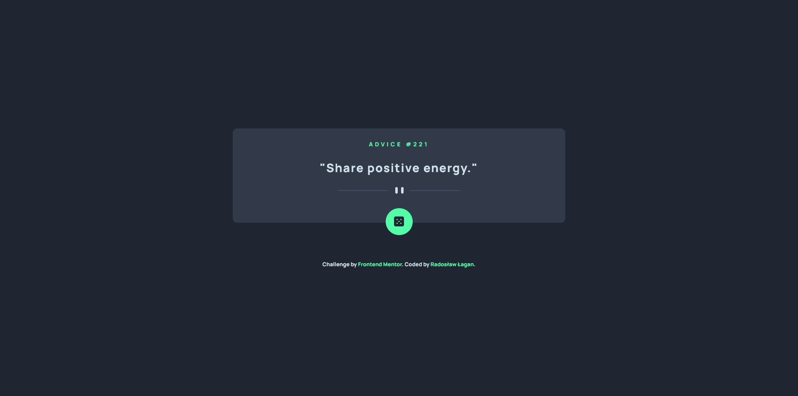

# Frontend Mentor - Advice generator app | solution

This is a solution to the [Advice generator app challenge on Frontend Mentor](https://www.frontendmentor.io/challenges/advice-generator-app-QdUG-13db). Frontend Mentor challenges help you improve your coding skills by building realistic projects.

## Overview

### The challenge

Users should be able to:

- View the optimal layout for the site depending on their device's screen size
- See hover states for all interactive elements on the page
- See new advice after every click on the dice icon

### Screenshot

### Links

- Live Site URL: [HERE](link)

## My process

### Built with

- HTML5
- SCSS
- BEM
- Flexbox
- Mobile-first workflow
- Advice Slip JSON API (https://api.adviceslip.com/)
